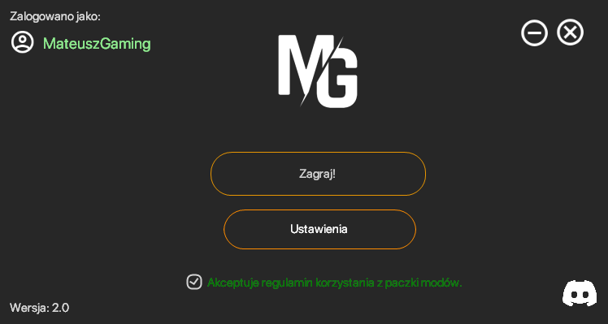

<!DOCTYPE html>
<html lang="pl">

<head>
    <link rel="icon" type="image/x-icon" href="img\ico.ico">
    <meta charset=" UTF-8">
    <meta http-equiv="X-UA-Compatible" content="IE=edge">
    <meta name="viewport" content="width=device-width, initial-scale=1.0">
    <title>MGLauncher</title>
    <link rel="stylesheet" href="style.css">
    <link rel="stylesheet" href="style-mobile.css">
    <link rel="stylesheet" href="style-other.css">
    <link rel="stylesheet" href="style-all.css">
    <meta name="description" content="Launcher do paczki modów Minecraft - MGLauncher ">
    <meta name="keywords" content="launcher, mateuszpack, paczka modów, mglauncher">
    
    <link rel="stylesheet" href="css/fontello.css">
    

</head>

<body>

    

        

            

                
            

        

        

            <h1>MGLauncher</h1>
            
Wejdź w kwadratowy świat, jakiego dotąd nie widziałeś.

            <a href="#download-page">
                

            </a>

        

        

            

                

                    
                    <a><button onclick="Download()" download="MGLauncher.zip" id="download-btn">Pobierz
                            MGLauncher</button>
                        

                             
                            
Wersja Minecraft'a: 1.12.2

                            
Launcher: 2.0

                        

                    </a>

                    

                    

                        <h1 id="tytul">Lista modów</h1>

                        <ul>
                            <li>Aether</li>
                            <li>Atum</li>
                            <li>Backpacks</li>
                            <li>BetterAnimals</li>
                            <li>Biomes O' Plenty</li>
                            <li>BuildCraft</li>
                            <li>Camping Mod</li>
                            <li>Chocolate Quest</li>
                            <li>CloudBoots'y</li>
                            <li>DaVinci Vessels</li>
                            <li>DynamicSurroundings</li>
                            <li>DynamicTrees</li>
                            <li>Furniture Mod</li>
                            <li>Gravestone's</li>
                            <li>HWYLA</li>
                            <li>InventoryPets</li>
                            <li>InventoryTweaks</li>
                            <li>IronChest</li>
                            <li>IvToolKit</li>
                            <li>JEI</li>
                            <li>LuckyBlocks</li>
                            <li>OreSpawn</li>
                            <li>Rogulelike Dangeons</li>
                            <li>Ruins</li>
                            <li>Teleporters</li>
                            <li>StorageDrawers</li>
                            <li>TreeCapitator</li>
                            <li>Twilight forest</li>
                            <li>Xaeros Minimap</li>

                        </ul>

                    

                

            

            

        

    

    

        

            
copyright © 2022 | all rights reserved

            
by
            
 <i class="fab fa-discord"></i> żyrafka na biegunach#1998

            
pompownik777

        

    

</body>

</html>